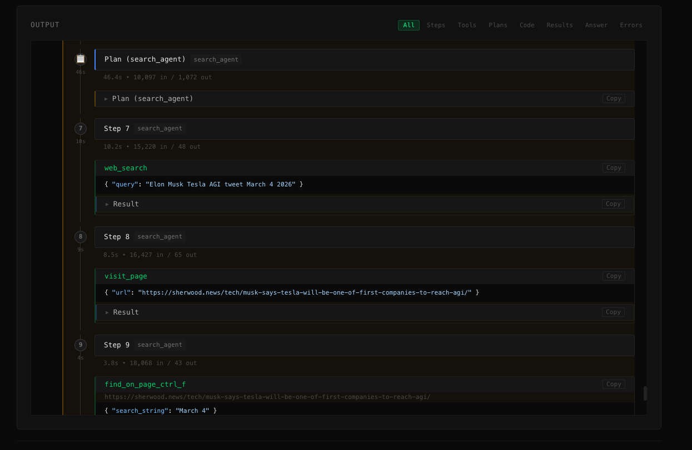

# Open Deep Research

[](https://opensource.org/licenses/Apache-2.0)
[](https://www.python.org/)
[](https://ghcr.io/s2thend/open-deep-research-with-ui)

Une réplication open source de [Deep Research d'OpenAI](https://openai.com/index/introducing-deep-research/) avec une interface web moderne — adaptée de [HuggingFace smolagents](https://github.com/huggingface/smolagents/tree/main/examples) avec une configuration simplifiée pour un auto-hébergement facile.

En savoir plus sur l'implémentation originale dans le [billet de blog HuggingFace](https://huggingface.co/blog/open-deep-research).

Cet agent atteint **55% pass@1** sur le jeu de validation GAIA, contre **67%** pour Deep Research d'OpenAI.

---

## Fonctionnalités

- **Recherche parallèle en arrière-plan** — lancez plusieurs tâches de recherche simultanément, surveillez-les indépendamment et consultez les résultats plus tard — même après avoir fermé le navigateur
- **Pipeline de recherche multi-agents** — Manager + sous-agents de recherche avec sortie en streaming en temps réel
- **Interface web moderne** — SPA basée sur Preact avec sections repliables, sélecteur de modèle et prise en charge de la copie
- **Support de modèles flexible** — Tout modèle OpenAI, Anthropic, DeepSeek, Ollama et tout fournisseur compatible OpenAI
- **Moteurs de recherche multiples** — DuckDuckGo (gratuit), SerpAPI, MetaSo avec repli automatique
- **Historique de session** — Stockage de session basé sur SQLite avec support de relecture
- **Trois modes d'exécution** — Live (temps réel), Background (persistant), Auto-kill (one-shot)
- **Découverte automatique de modèles** — Détecte les modèles disponibles des fournisseurs configurés
- **Outils visuels et médias** — Questions-réponses sur images, analyse PDF, transcription audio, transcriptions YouTube
- **Prêt pour la production** — Docker, Gunicorn, multi-worker, vérifications de santé, configurable via JSON

**Captures d'écran :**

<div align="center">
  
  <p><em>Interface d'entrée épurée avec sélection de modèle</em></p>

  
  <p><em>Affichage en temps réel du raisonnement de l'agent, des appels d'outils et des observations</em></p>

  
  <p><em>Réponse finale mise en évidence avec sections repliables</em></p>
</div>

---

## Recherche parallèle en arrière-plan

Les tâches de recherche approfondie sont lentes — une seule exécution peut prendre 10 à 30 minutes. La plupart des outils bloquent l'interface jusqu'à la fin de la tâche, vous forçant à attendre.

Ce projet adopte une approche différente : **lancez autant de tâches de recherche que vous le souhaitez et laissez-les s'exécuter en arrière-plan — simultanément.**

```
┌─────────────────────────────────────────────────────┐
│  Question A : "Quelles sont les dernières avancées en LLMs ?"  │  ← en cours
│  Question B : "Comparer les meilleures bases de données vectorielles en 2025"  │  ← en cours
│  Question C : "Liste de contrôle de conformité à l'AI Act de l'UE"  │  ← terminé ✓
└─────────────────────────────────────────────────────┘
        Toutes visibles dans la barre latérale. Cliquez sur n'importe laquelle pour inspecter.
```

**Comment ça fonctionne :**

1. Sélectionnez le mode d'exécution **Background** ou **Auto-kill** (par défaut)
2. Soumettez votre première question de recherche — l'agent démarre immédiatement dans un sous-processus
3. L'interface n'est pas bloquée — soumettez une deuxième question, une troisième, autant que nécessaire
4. Chaque agent s'exécute indépendamment, persistant toutes ses étapes de raisonnement et résultats dans SQLite
5. Utilisez la barre latérale pour basculer entre les sessions en cours en temps réel
6. Fermez le navigateur — en mode **Background**, les agents continuent de s'exécuter sur le serveur
7. Revenez plus tard et cliquez sur n'importe quelle session pour relire la trace complète de recherche

**Comparaison des modes d'exécution :**

| Mode | Plusieurs à la fois | Survit à la fermeture du navigateur | Interface bloquée |
|---|---|---|---|
| **Background** | ✅ | ✅ | ✗ |
| **Auto-kill** | ✅ | ✗ (arrêté à la fermeture de l'onglet) | ✗ |
| **Live** | ✗ | ✗ | ✅ |

Particulièrement utile pour :
- Les flux de travail de recherche par lots où vous mettez en file d'attente plusieurs questions liées et examinez les résultats ensemble
- Les requêtes longues où vous ne souhaitez pas maintenir un onglet ouvert
- Les équipes partageant une instance auto-hébergée avec plusieurs utilisateurs simultanés

---

## Pourquoi ce projet ?

- **Installation Docker en une commande, zéro config pour démarrer** — `docker run -p 5080:5080 ghcr.io/s2thend/open-deep-research-with-ui:latest` et une UI web fonctionnelle est en ligne. Recherche DuckDuckGo intégrée ; une seule clé API modèle suffit pour commencer.

- **Pas de dépendance LiteLLM** — uniquement des appels directs aux SDKs officiels OpenAI + Anthropic. Supprime la couche intermédiaire de traduction LiteLLM qui a fait l'objet d'avis de sécurité répétés. Plus sûr pour les déploiements entreprise / internes.

- **Compatible air-gap, auto-hébergeable** — pas de télémétrie, pas de dépendances à des services tiers au-delà des APIs modèle et recherche que vous configurez explicitement. Couplez avec Ollama / LM Studio / vLLM pour un fonctionnement entièrement hors-ligne derrière n'importe quel pare-feu.

- **Conçu pour être forké** — ~3K LOC Python au-dessus de smolagents. Ajoutez un outil en déposant un fichier dans `scripts/` ; changez de fournisseur via `scripts/model_routing.py` ; branchez-vous sur les step callbacks de l'agent (voir `scripts/compaction.py`). Un point de départ pour *votre* agent de recherche interne, pas un produit fermé.

- **Recherche multi-fournisseurs avec fallback automatique** — DDGS, Tavily, SerpAPI, MetaSo, Bocha — câblés d'origine. Configurez en liste ordonnée ; l'agent parcourt la chaîne sur résultats vides ou erreurs de rate-limit. Adapté aux équipes inter-régionales, déploiements en Chine, et environnements air-gap.

- **Recherche parallèle en arrière-plan** — la fonctionnalité la plus unique dans cet espace. Lancez plusieurs tâches de recherche simultanément ; chacune persiste dans SQLite. Fermez le navigateur, revenez des heures plus tard, les résultats vous attendent. Aucun autre outil de deep research open source ne supporte ce workflow.

### Comparaison avec les alternatives

| Fonctionnalité | **Ce projet** | [nickscamara/open-deep-research](https://github.com/nickscamara/open-deep-research) | [gpt-researcher](https://github.com/assafelovic/gpt-researcher) | [langchain/open_deep_research](https://github.com/langchain-ai/open_deep_research) | [smolagents](https://github.com/huggingface/smolagents) |
|---|---|---|---|---|---|
| **Docker / déploiement en une commande** | ✅ Image pré-construite sur GHCR | ✅ Dockerfile | ✅ Docker Compose | ❌ Manuel | ❌ Bibliothèque uniquement |
| **Sans dépendance LiteLLM** | ✅ SDKs OpenAI + Anthropic directs | ⚠️ Couche AI SDK | ⚠️ | ⚠️ Couche langchain | ✅ |
| **Déploiement air-gap / réseau interne** | ✅ Pas de télémétrie, pas de deps externes | ⚠️ Dépend de Firecrawl | ⚠️ Défauts orientés cloud | ⚠️ LangGraph Studio | ✅ |
| **Recherche multi-fournisseurs avec fallback** | ✅ DDGS + Tavily + SerpAPI + MetaSo + Bocha | ❌ Firecrawl uniquement | ⚠️ Un seul par run | ⚠️ Configurable | ⚠️ DIY |
| **Fournisseurs de modèles régionaux** | ✅ DeepSeek de premier ordre | ⚠️ Centré US | ⚠️ Centré US | ⚠️ Centré US | ✅ |
| **Frontend sans build** | ✅ Preact + htm (pas d'étape de build) | ❌ Build Next.js requis | ❌ Build Next.js requis | ❌ LangGraph Studio | — |
| **Recherche gratuite dès la sortie de la boîte** | ✅ DuckDuckGo (pas de clé requise) | ❌ API Firecrawl requise | ⚠️ Clé recommandée | ⚠️ Configurable | ✅ |
| **Support modèles locaux** | ✅ Ollama, LM Studio | ⚠️ Limité | ✅ Ollama/Groq | ✅ | ✅ |
| **Tâches parallèles en arrière-plan** | ✅ Exécutions simultanées multiples | ❌ | ❌ | ❌ | ❌ |
| **Historique / relecture de session** | ✅ Basé sur SQLite | ❌ | ❌ | ❌ | ❌ |
| **Interface streaming** | ✅ SSE, 3 modes d'exécution | ✅ Activité en temps réel | ✅ WebSocket | ✅ Stream type-safe | ❌ |
| **Analyse visuelle / images** | ✅ Captures PDF, QA visuel | ❌ | ⚠️ Limité | ❌ | ⚠️ |
| **Audio / YouTube** | ✅ Transcription, parole | ❌ | ❌ | ❌ | ❌ |
| **Score de référence GAIA** | **55% pass@1** | — | — | — | 55% (original) |

---

## Démarrage rapide

### 1. Cloner le dépôt

```bash
git clone https://github.com/S2thend/open-deep-research-with-ui.git
cd open-deep-research-with-ui
```

### 2. Installer les dépendances système

Le projet nécessite **FFmpeg** pour le traitement audio.

- **macOS** : `brew install ffmpeg`
- **Linux** : `sudo apt-get install ffmpeg`
- **Windows** : `choco install ffmpeg` ou télécharger depuis [ffmpeg.org](https://ffmpeg.org/download.html)

Vérifier : `ffmpeg -version`

### 3. Installer les dépendances Python

```bash
python3 -m venv venv
source venv/bin/activate  # Sous Windows : venv\Scripts\activate
pip install -e .
```

### 4. Configurer

Copiez la configuration d'exemple et ajoutez vos clés API :

```bash
cp odr-config.example.json odr-config.json
```

Modifiez `odr-config.json` pour définir votre fournisseur de modèle et vos clés API (voir [Configuration](#configuration) ci-dessous).

### 5. Lancer

```bash
# Interface web (recommandé)
python web_app.py
# Ouvrir http://localhost:5080

# CLI
python run.py --model-id "gpt-4o" "Votre question de recherche ici"
```

---

## Configuration

Deux couches de configuration :

1. **`odr-config.json`** — principale, JSON, contrôle tout (modèles, comportement de l'agent, fournisseurs de recherche, navigateur, limites, compaction). Créé automatiquement à partir de `odr-config.example.json` au premier lancement.
2. **`.env`** — optionnel, pour les secrets que vous préférez ne pas mettre en JSON ou pour les déploiements Docker.

Les clés API dans `odr-config.json` ont priorité sur les valeurs `.env` quand les deux sont définies.

### Référence complète odr-config.json

Copiez `odr-config.example.json` vers `odr-config.json` et éditez. Schéma complet :

```json
{
  "agent": {
    "search_agent_max_steps": 20,
    "manager_agent_max_steps": 12,
    "planning_interval": 4,
    "verbosity_level": 2
  },
  "model": {
    "providers": [
      {"provider": "openai",    "api_key": "sk-...", "base_url": ""},
      {"provider": "deepseek",  "api_key": "",       "base_url": ""},
      {"provider": "anthropic", "api_key": "",       "base_url": ""}
    ],
    "default_model_id": "o1",
    "max_completion_tokens": 32768,
    "reasoning_effort": "high",
    "retry_max_attempts": 5,
    "retry_wait_seconds": 30
  },
  "search": {
    "providers": [
      {"provider": "DDGS",      "key": ""},
      {"provider": "TAVILY",    "key": ""},
      {"provider": "SERPAPI",   "key": ""},
      {"provider": "META_SOTA", "key": ""},
      {"provider": "BOCHA",     "key": ""}
    ],
    "max_results": 10
  },
  "browser": {
    "viewport_size": 5120,
    "request_timeout": 300
  },
  "limits": {
    "text_limit": 100000,
    "max_field_length": 50000
  },
  "compaction": {
    "enabled": true,
    "summarizer_model_id": null,
    "summary_threshold_tokens": 1000,
    "summary_max_tokens": 600,
    "summary_input_cap_tokens": 6000,
    "plan_keep_back": 3,
    "gap_summary_max_tokens": 500,
    "max_retries": 10
  },
  "other_keys": {"hf_token": ""},
  "models": [ /* Menu déroulant UI — liste de {id, name, description} */ ]
}
```

L'interface expose un panneau de paramètres qui édite le même fichier. Les éditions côté serveur via l'UI sont protégées par `CONFIG_ADMIN_PASSWORD` lorsque `ENABLE_CONFIG_UI=true`.

#### `agent` — boucle de recherche multi-étapes

| Clé | Défaut | Effet |
|---|---|---|
| `search_agent_max_steps` | `20` | Nombre max d'étapes ReAct du **sous-agent search** par tâche. Chaque étape = 1 appel LLM + 1 appel d'outil (recherche web, navigation, inspection de texte). Plus grand = recherche plus profonde par sous-tâche, mais chaque étape supplémentaire ajoute ~5–30K tokens d'observation au contexte. |
| `manager_agent_max_steps` | `12` | Nombre max d'étapes du **manager**. Chaque étape délègue généralement à un sous-agent ou synthétise. Rarement à augmenter ; toucher la limite suggère que la question doit être divisée. |
| `planning_interval` | `4` | Insère une étape "re-planification" toutes les N étapes d'action. Plus bas = plus de correction de cap (utile quand l'agent dérive) ; plus haut = moins d'appels de planification (moins cher, plus rapide). |
| `verbosity_level` | `2` | Verbosité du logger. `0` silencieux, `1` info, `2` debug. |

#### `model` — routage des fournisseurs LLM

| Clé | Défaut | Effet |
|---|---|---|
| `providers[]` | OpenAI/DeepSeek/Anthropic vides | Liste de credentials. Chaque entrée : `{"provider": "<openai\|deepseek\|anthropic\|...>", "api_key": "...", "base_url": ""}`. Le champ `base_url` permet de pointer vers un endpoint auto-hébergé ou proxy parlant le protocole du fournisseur (par ex. l'API OpenAI-compatible d'Ollama). Le premier fournisseur correspondant au routage de `default_model_id` est utilisé. |
| `default_model_id` | `"o1"` | Quel modèle l'agent utilise. Routage automatique selon le préfixe — voir [Modèles supportés](#modèles-supportés). Override par-run avec `--model-id`. |
| `max_completion_tokens` | `32768` | Plafond de tokens en sortie **avant clamping**. Chaque modèle a un plafond dur (gpt-4o-mini : 16K, deepseek-chat : 8K, o1 : 100K, claude-sonnet-4 : 64K). La valeur effective passée à l'API est `min(ce_paramètre, plafond_modèle)` — en gardant le défaut `32768`, les petits modèles se clampent silencieusement à leur propre plafond, donc jamais de 4xx pour "max_tokens too large". Baisser n'aide que pour des sorties plus courtes ; dépasser le plafond du modèle est un no-op. |
| `reasoning_effort` | `"high"` | Utilisé uniquement si `default_model_id` est `"o1"`. Valeurs : `"low"`, `"medium"`, `"high"`. Compromis latence/coût vs profondeur de raisonnement. |
| `retry_max_attempts` | `5` | Nombre de retries pour erreurs transitoires (HTTP 429, déconnexions, lectures partielles). Note : ne retry **pas** sur les erreurs context-overflow / 400 (irrécupérables). |
| `retry_wait_seconds` | `30` | Backoff initial entre retries. Double à chaque tentative avec jitter (backoff exponentiel). |

#### `search` — fournisseurs et nombre de résultats

| Clé | Défaut | Effet |
|---|---|---|
| `providers[]` | DDGS en premier, autres vides | Chaîne de fallback ordonnée. L'agent tente le premier ; si vide ou erreur, passe au suivant. Ajoutez un champ `key` par entrée (DDGS n'en a pas besoin). Liste complète des fournisseurs : voir [Moteurs de recherche](#moteurs-de-recherche) ci-dessous. |
| `max_results` | `10` | Combien de résultats par requête. Chaque résultat = title + snippet + URL (~quelques centaines de tokens). Plus grand = filet plus large, mais observations plus longues. À baisser si vous touchez les limites de contexte sans compaction. |

#### `browser` — outil navigateur texte

| Clé | Défaut | Effet |
|---|---|---|
| `viewport_size` | `5120` | Caractères visibles par vue de page dans le navigateur simulé. L'agent utilise `page_up`/`page_down`. Plus grand = moins de scroll mais observations plus grandes. Plus petit = plus de navigation mais chaque observation plus petite. |
| `request_timeout` | `300` | Secondes d'attente pour un fetch HTTP. Sites lents ou petites VMs peuvent nécessiter plus. |

#### `limits` — gardes-fous de taille

| Clé | Défaut | Effet |
|---|---|---|
| `text_limit` | `100000` | Caractères max retournés par `text_inspector_tool` (lecteur de fichiers PDF / gros docs). Empêche un seul appel `inspect_file_as_text` de saturer la mémoire de l'agent. |
| `max_field_length` | `50000` | Caractères max par **champ d'événement SSE** envoyé au frontend (côté affichage uniquement — ne réduit **pas** l'input LLM). Baisser économise juste la bande passante serveur → navigateur. |

#### `compaction` — compaction LLM du contexte (Layer 1 + Layer 2)

Sans cela, smolagents accumule indéfiniment chaque observation brute et les runs de 20 étapes dépassent inéluctablement les fenêtres de contexte des modèles. Voir `scripts/compaction.py` pour l'implémentation.

| Clé | Défaut | Effet |
|---|---|---|
| `enabled` | `true` | Switch principal. `false` revient au comportement d'observation brute (plus rapide par étape, mais les longs runs peuvent crasher sur context overflow). |
| `summarizer_model_id` | `null` | `null` = utilise le modèle principal de l'agent (le plus simple, sans config supplémentaire). Override avec un id de modèle pas cher (par ex. `"deepseek-chat"`) pour réduire coût/latence de la résumation. **Le chemin d'override est réservé à une future PR ; aujourd'hui la valeur est lue mais le modèle principal est toujours utilisé.** |
| `summary_threshold_tokens` | `1000` | **Layer 1** : skip de la résumation par étape si l'observation fait moins (en tokens, comptés via tiktoken `cl100k_base`). En dessous de 1000 tokens, l'économie ne vaut pas le coût de l'appel LLM. |
| `summary_max_tokens` | `600` | **Layer 1** : longueur cible de la sortie du résumé par étape. Préserve faits, chiffres, URLs ; jette les chrome de navigation et l'HTML répétitif. |
| `summary_input_cap_tokens` | `6000` | **Layer 1** : input max envoyé au summarizer (trim head + tail si l'observation est plus grande). Plafonne le coût de contexte du summarizer lui-même. |
| `plan_keep_back` | `3` | **Layer 2** : combien de plan-gaps récents restent non compactés. Avec `planning_interval=4` et 20 étapes search-agent, déclenche une fois par run typique (compacte le plus vieux gap). Plus bas (`2` ou `1`) pour consolider plus agressivement. |
| `gap_summary_max_tokens` | `500` | **Layer 2** : longueur cible de chaque résumé de gap consolidé. Les URLs du gap sont ajoutées telles quelles. |
| `max_retries` | `10` | Retries pour l'appel LLM de compaction (couche de retry au-dessus du retrier interne du modèle). Reflète le budget par défaut de Claude Code. Après épuisement, fallback sur troncature head+tail tokens plutôt que crasher le run. |

#### `other_keys` — tokens divers

| Clé | Défaut | Effet |
|---|---|---|
| `hf_token` | `""` | Token HuggingFace. Requis uniquement pour le benchmark GAIA (`run_gaia.py`) qui télécharge le dataset de validation. |

#### `models` — menu déroulant UI

Liste purement d'affichage de triplets `{id, name, description}` pour le sélecteur de modèle dans l'UI web. Éditer ceci n'affecte que l'UI. Le modèle réellement utilisé est ce que `default_model_id` (ou CLI `--model-id`) résout.

### Variables d'environnement

Pour Docker ou si vous préférez ne pas mettre les secrets en JSON, copiez `.env.example` vers `.env` :

```bash
cp .env.example .env
```

| Variable | Effet |
|---|---|
| `ENABLE_CONFIG_UI` | Si `true`, expose l'endpoint d'édition de config côté serveur dans l'UI. Défaut `false`. |
| `CONFIG_ADMIN_PASSWORD` | Mot de passe pour l'UI de config côté serveur. Requis si `ENABLE_CONFIG_UI=true`. |
| `META_SOTA_API_KEY` | Clé API pour la recherche MetaSo. Fallback si `search.providers[].key` est vide. |
| `SERPAPI_API_KEY` | Clé API pour SerpAPI. Même règle de fallback. |
| `BOCHA_API_KEY` | Clé API pour Bocha AI (博查). Même règle de fallback. |
| `TAVILY_API_KEY` | Clé API pour Tavily. Même règle de fallback. |
| `OPENAI_API_KEY` | Clé OpenAI. Utilisée si l'entrée openai de `model.providers[]` n'a pas d'`api_key`. |
| `ANTHROPIC_API_KEY` | Clé Anthropic. Même règle de fallback. |
| `DEEPSEEK_API_KEY` | Clé DeepSeek. Même règle de fallback. |
| `HF_TOKEN` | Token HuggingFace. Fallback pour `other_keys.hf_token`. |
| `DEBUG` | Active le logging de debug (`false` par défaut). |
| `LOG_LEVEL` | Verbosité — `DEBUG`, `INFO`, `WARNING`, `ERROR` (`INFO` par défaut). |

> [!NOTE]
> Les clés dans `odr-config.json` ont priorité sur `.env`.

### Modèles supportés

Supporte OpenAI, Anthropic, DeepSeek, Ollama et tout fournisseur compatible OpenAI. Le routage du modèle est automatique selon le préfixe de l'id. Exemples :

```bash
python run.py --model-id "gpt-4o" "Votre question"
python run.py --model-id "o1" "Votre question"
python run.py --model-id "claude-sonnet-4-6" "Votre question"
python run.py --model-id "deepseek/deepseek-chat" "Votre question"
python run.py --model-id "ollama/mistral" "Votre question"  # modèle local
```

`max_completion_tokens` est automatiquement clampé au plafond de sortie publié de chaque modèle (table complète dans `scripts/model_routing.py`). Pas besoin d'abaisser la config en passant à un modèle à petit plafond.

> [!WARNING]
> Le modèle `o1` nécessite un accès API OpenAI tier-3 : https://help.openai.com/en/articles/10362446-api-access-to-o1-and-o3-mini

### Moteurs de recherche

| Moteur | Clé requise | Notes |
|---|---|---|
| `DDGS` | Non | DuckDuckGo, gratuit, défaut. |
| `TAVILY` | Oui | Tavily, souvent la meilleure qualité de résultats pour les requêtes anglaises. |
| `META_SOTA` | Oui | MetaSo, optimisé pour les requêtes chinoises. |
| `SERPAPI` | Oui | Résultats Google via SerpAPI. |
| `BOCHA` | Oui | Bocha AI (博查), recherche web optimisée pour le chinois. |

Plusieurs moteurs peuvent être listés dans `search.providers[]` — l'agent les essaie dans l'ordre et passe au suivant en cas de résultats vides ou d'erreurs.

---

## Utilisation

### Interface web

```bash
python web_app.py
# ou avec hôte/port personnalisé :
python web_app.py --port 8000 --host 0.0.0.0
```

Ouvrez `http://localhost:5080` dans votre navigateur.

**Modes d'exécution** (disponibles via le bouton divisé dans l'interface) :

| Mode | Comportement |
|---|---|
| **Live** | Sortie en streaming en temps réel ; la session se termine à la déconnexion |
| **Background** | L'agent s'exécute de manière persistante ; reconnectez-vous à tout moment pour voir les résultats |
| **Auto-kill** | L'agent s'exécute, la session est nettoyée après la fin |

### CLI

```bash
python run.py --model-id "gpt-4o" "Quelles sont les dernières avancées en informatique quantique ?"
```

### Référence GAIA

```bash
# Nécessite HF_TOKEN pour le téléchargement du jeu de données
python run_gaia.py --model-id "o1" --run-name my-run
```

---

## Déploiement

### Docker (Recommandé)

Des **images pré-construites** sont disponibles sur GitHub Container Registry :

```bash
docker pull ghcr.io/s2thend/open-deep-research-with-ui:latest

docker run -d \
  --env-file .env \
  -v ./odr-config.json:/app/odr-config.json \
  -p 5080:5080 \
  --name open-deep-research \
  ghcr.io/s2thend/open-deep-research-with-ui:latest
```

**Docker Compose** (inclut un volume pour les fichiers téléchargés) :

```bash
cp .env.example .env        # configurer les clés API
cp odr-config.example.json odr-config.json  # configurer les modèles
docker-compose up -d
docker-compose logs -f      # suivre les logs
docker-compose down         # arrêter
```

**Construire votre propre image :**

```bash
docker build -t open-deep-research .
docker run -d --env-file .env -p 5080:5080 open-deep-research
```

> [!WARNING]
> Ne jamais committer `.env` ou `odr-config.json` avec de vraies clés API dans git. Toujours passer les secrets à l'exécution.

### Gunicorn (Production)

```bash
pip install -e .
gunicorn -c gunicorn.conf.py web_app:app
```

Le fichier `gunicorn.conf.py` inclus est pré-configuré avec :
- Gestion des processus multi-workers
- Délai d'attente de 300 s pour les tâches d'agent longues
- Journalisation et gestion des erreurs appropriées

---

## Architecture

### Pipeline d'agents

```
Question de l'utilisateur
    │
    ▼
Agent Manager (CodeAgent / ToolCallingAgent)
    │  Planifie une stratégie de recherche en plusieurs étapes
    ├──▶ Sous-Agent de recherche × N
    │       │  Recherche web → navigation → extraction
    │       └──▶ Outils : DuckDuckGo/SerpAPI/MetaSo, VisitWebpage,
    │                   TextInspector, VisualQA, YoutubeTranscript
    │
    └──▶ Synthèse de la réponse finale
```

### Pipeline de streaming

```
run.py  (step_callbacks → JSON-lines sur stdout)
  │
  ▼
web_app.py  (sous-processus → Server-Sent Events)
  │
  ▼
Navigateur  (composants Preact → DOM)
```

**Types d'événements SSE :**

| Événement | Description |
|---|---|
| `planning_step` | Raisonnement et plan de l'agent |
| `code_running` | Code en cours d'exécution |
| `action_step` | Appel d'outil + observation |
| `final_answer` | Résultat de recherche terminé |
| `error` | Erreur avec détails |

### Hiérarchie DOM

```
#output
├── step-container.plan-step       (plan du manager)
├── step-container                 (étape du manager)
│   └── step-children
│       ├── model-output           (raisonnement)
│       ├── Agent Call             (code, replié)
│       └── sub-agent-container
│           ├── step-container.plan-step  (plan du sous-agent)
│           ├── step-container            (étapes du sous-agent)
│           └── sub-agent-result          (aperçu + repliable)
└── final_answer                   (bloc de résultat proéminent)
```

---

## Reproductibilité (Résultats GAIA)

Le résultat 55% pass@1 sur GAIA a été obtenu avec des données augmentées :

- Les PDFs d'une seule page et les fichiers XLS ont été ouverts et capturés en `.png`
- Le chargeur de fichiers vérifie la version `.png` de chaque pièce jointe et la préfère

Le jeu de données augmenté est disponible sur [smolagents/GAIA-annotated](https://huggingface.co/datasets/smolagents/GAIA-annotated) (accès accordé instantanément sur demande).

---

## Développement

```bash
pip install -e ".[dev]"   # inclut les outils de test, linting, vérification de types
python web_app.py         # démarre le serveur de développement avec rechargement automatique
```

Le frontend est une application Preact sans dépendances utilisant `htm` pour les gabarits de type JSX — pas d'étape de build requise. Modifiez les fichiers dans `static/js/components/` et actualisez.

---

## Licence

Sous licence **Apache License 2.0** — la même licence que [smolagents](https://github.com/huggingface/smolagents).

Voir [LICENSE](../LICENSE) pour les détails.

**Remerciements :**
- Implémentation originale de l'agent de recherche par [HuggingFace smolagents](https://github.com/huggingface/smolagents)
- Interface web, gestion de sessions, architecture de streaming et système de configuration ajoutés dans ce fork
